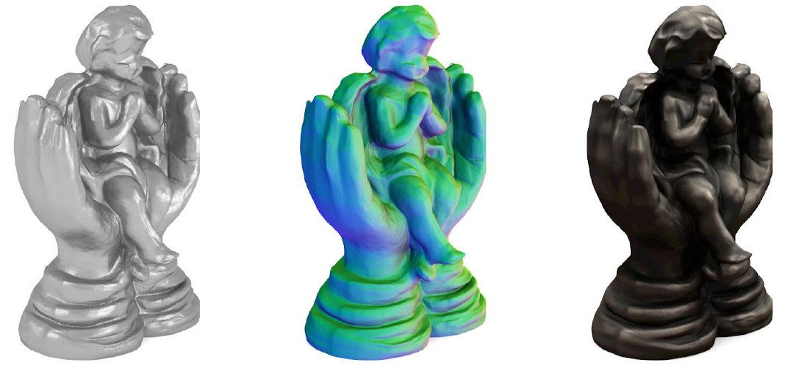
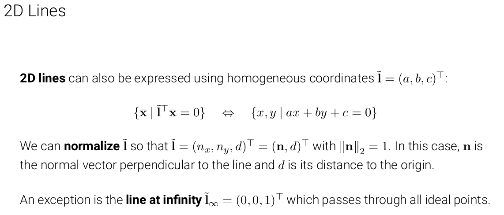

# Computer_Vision_notebook

It's a notebook of Computer Vision which is instructed by Prof. Dr.-Ing. Andreas Geiger in 2021.

Class link: [youtube](https://www.youtube.com/playlist?list=PL05umP7R6ij35L2MHGzis8AEHz7mg381_)

[Course Website](https://uni-tuebingen.de/fakultaeten/mathematisch-naturwissenschaftliche-fakultaet/fachbereiche/informatik/lehrstuehle/autonomous-vision/lectures/computer-vision/) with Slides, Lecture Notes, Problems and Solutions.

## L1 Introduction

### 1.1 Organization

#### Contents

#### Course Materials

##### Books

- Szeliski: Computer Vision: Algorithms and Applications
  - https://szeliski.org/Book/
- Hartley and Zisserman: Multiple View Geometry in Computer Vision
  - https://www.robots.ox.ac.uk/~vgg/hzbook/
- Nowozin and Lampert: Structured Learning and Prediction in Computer Vision
  - https://pub.ist.ac.at/~chl/papers/nowozin-fnt2011.pdf
- Goodfellow, Bengio, Courville: Deep Learning
  - http://www.deeplearningbook.org/
- Deisenroth, Faisal, Ong: Mathematics for Machine Learning
  - https://mml-book.github.io
- Petersen, Pedersen: The Matrix Cookbook
  - http://cs.toronto.edu/~bonner/courses/2018s/csc338/matrix_cookbook.pdf

##### Tutorials

- The Python Tutorial
  - https://docs.python.org/3/tutorial/
- NumPy Quickstart
  - https://numpy.org/devdocs/user/quickstart.html
- PyTorch Tutorial
  - https://pytorch.org/tutorials/
- Latex / Overleaf Tutorial
  - https://www.overleaf.com/learn

##### Frameworks / IDEs

- Visual Studio Code
  - https://code.visualstudio.com/
- Google Colab
  - https://colab.research.google.com

##### Courses

- Gkioulekas (CMU): Computer Vision
  - http://www.cs.cmu.edu/~16385/
- Owens (University of Michigan): Foundations of Computer Vision
  - https://web.eecs.umich.edu/~ahowens/eecs504/w20/
- Lazebnik (UIUC): Computer Vision
  - https://slazebni.cs.illinois.edu/spring19/
- Freeman and Isola (MIT): Advances in Computer Vision
  - http://6.869.csail.mit.edu/sp21/
- Seitz (University of Washington): Computer Vision
  - https://courses.cs.washington.edu/courses/cse576/20sp/
- Slide Decks covering Szeliski Book
  - http://szeliski.org/Book/

#### Prerequisites

##### Basic skills

- Basic math skills
  - Linear algebra, probability and information theory. If unsure, have a look at:
    - Goodfellow et al.: [Deep Learning (Book)](https://www.deeplearningbook.org/), Chapters 1-4
    - Luxburg: [Mathematics for Machine Learning (Lecture)](http://www.tml.cs.uni-tuebingen.de/teaching/2020_maths_for_ml/index.php)
    - Deisenroth et al.: [Mathematics for Machine Learning (Book)](https://mml-book.github.io/)
- Basic computer science skills
  - Variables, functions, loops, classes, algorithms
- Basic Python and PyTorch coding skills
  - https://docs.python.org/3/tutorial/
  - https://pytorch.org/tutorials/
- Experience with deep learning. If unsure, have a look at:
  - Geiger: [Deep Learning (Lecture)](https://uni-tuebingen.de/fakultaeten/mathematisch-naturwissenschaftliche-fakultaet/fachbereiche/informatik/lehrstuehle/autonomous-vision/lectures/deep-learning/)

##### Linear Algebra

- vector: $x,y \in \mathbb{R}^n$
- Matrices: $A,B \in \mathbb{R}^{m\times n}$
- Operations: $A^T, A^{-1}, Tr(A), det(A), A+B, AB, Ax, x^Ty$
- Norms: $\left \| x \right \|_1, \left \| x \right \| _2, \left \| x \right \| _\infty, \left \| A \right \| _F$
- SVD: $A = UDV^T$

##### Probability and Information Theory

- Probability distributions: $P(X=x)$
- Marginal / conditional: $p(x)=\int p(x,y)dy, p(x,y)=p(x|y)p(y)$
- Bayes rule: $p(x|y)=p(y|x)p(x)/p(y)$
- Conditional independence: $x\perp\!\!\!\perp y|z\Leftrightarrow r(x,y|z)=p(x|z)p(y|z)$
- Expectation: $\mathbb{E}_{x\sim p}[f(x)]=\int_x p(x)f(x)dx$
- Variance: $\mathrm{Var}(f(x))=\mathbb{E}[(f(x)-\mathbb{E}[f(x)])^2]$
- Distributions: Bernoulli, Categorical, Gaussian, Laplace
- Entropy: $H(x)$
- KL Divergence: $D_{KL}(p\parallel q)$

##### Deep Learning

- Machine learning basics, linear and logistic regression
- Computation graphs, backpropagation algorithm
- Activation and loss functions, initialization
- Regularization and optimization of deep neural networks
- Convolutional neural networks
- Recurrent neural networks
- Graph neural networks
- Autoencoders and generative adversarial networks

#### Time Management

### 1.2 Introduction

#### Relationships and differences between each conceptions

##### Computer Vision vs. Biological Vision

##### Computer Vision vs. Computer Graphics

###### Computer Vision is an ill-posed inverse problem

- Many 3D scenes yield the same 2D image
- Additional Constraints (knowledge about world) required

##### Computer Vision vs. Image Processing

##### Computer Vision vs. Machine Learning

###### The Deep Learning Revolution

###### CVPR Submitted and Accepted Papers

#### Why is Visual Perception hard?

##### Challenges: Images are 2D Projections of the 3D World

##### Challenges: Viewpoint Variation

##### Challenges: Deformation

##### Challenges: Occlusion

##### Challenges: illumination

##### Challenges: Motion

##### Challenges: Perception vs. Measurement

##### Challenges: Local Ambiguities

##### Challenges: Intra Class Variation

##### Challenges: Number of Object Categories

### 1.3 History of Computer Vision

#### Credits

- Svetlana Lazebnik (UIUC): Computer Vision: Looking Back to Look Forward
  - https://slazebni.cs.illinois.edu/spring20/
- Steven Seitz (Univ. of Washington): 3D Computer Vision: Past, Present, and Future
  - http://www.youtube.com/watch?v=kyIzMr917Rc
  - http://www.cs.washington.edu/homes/seitz/talks/3Dhistory.pdf

#### Overview

##### Waves of development

- 1960-1970: Blocks Worlds, Edges and Model Fitting
- 1970-1981: Low-level vision: stereo, flow, shape-from-shading
- 1985-1988: Neural networks, backpropagation, self-driving
- 1990-2000: Dense stereo and multi-view stereo, MRFs
- 2000-2010: Features, descriptors, large-scale structure-from-motion
- 2010-now: Deep learning, large datasets, quick growth, commercialization

#### A Brief History of Computer Vision

##### 1957: Stereo

##### 1958-1962: Rosenblatt's Perceptron

##### 1963: Larry Robert's Blocks World

##### 1966: MIT Summer Vision Project

##### 1969: Minsky and Papert publish book

##### 1970: MIT Copy Demo

##### 1970: Shape from Shading

##### 1978: Intrinsic Images

##### 1980: Photometric Stereo

##### 1981: Essential Matrix

##### 1981: Binocular Scanline Stereo

##### 1981: Dense Optical Flow

##### 1984: Markov Random Fields

##### 1980s: Part-based Models

##### 1986: Backpropagation Algorithm

##### 1986: Self-Driving Car VaMoRs

##### 1988: Self-Driving Car ALVIMN

##### 1992: Structure-from-Motion

##### 1992: Iterative Closest Points

##### 1996: Volumetric Fusion

##### 1998: Multi-View Stereo

##### 1998: Stereo with Graph Cuts

##### 1998: Convolutional Neural Networks

##### 1999: Morphable Models

##### 1999: SIFT

##### 2006: Photo Tourism

##### 2007: PMBS

##### 2009: Building Rome in a Day

##### 2011: Kinect

##### 2009-2012: ImageNet and AlexNet

##### 2002-now: Golden Age of Datasets

##### 2017-now: Syntheic Data

##### 2014: Visualization

##### 2014: Adversarial Examples

##### 2014: Generative Adversarial Networks

##### 2014: DeepFace

##### 2014: 3D Scene Understanding

##### 2014: 3D Scanning

##### 2015: Deep Reinforcement Learning

##### 2016: Style Transfer

##### 2015-2017: Semantic Segmentation

##### 2017: Mask R-CNN

##### 2017: Image Captioning

##### 2018: Human Shape and Pose

##### 2016-2020: 3D Deep Learning

##### Applications and Commercial Products

##### Current Challenges

- Un-/Self-Supervised Learning
- Interactive learning
- Accuracy (e.g., self-driving)
- Robustness and generalization
- Inductive biases
- Understanding and mathematics
- Memory and compute
- Ethics and legal questions

## L2 Image Formation

### 2.1 Primitives and Transformations

- Geometric primitives are the basic building blocks used to describe 3D shapes
- In this unit, we introduce **points, lines and planes**
- Furthermore, the most basic transformations are discussed
- This unit covers the topics of [the Szeliski book](https://szeliski.org/Book/), chapter 2.1
- A more exhaustive introduction can be found in the book:
  Hartley and Zisserman: Multiple View Geometry in Computer Vision

#### 2D Points

2D points can be written in inhomogeneous coordinates as $\mathrm{x}=\begin{pmatrix}x\\y\end{pmatrix}\in \mathbb{R}^2$, or in homogeneous coordinates as $\tilde{\mathrm{x}}=\begin{pmatrix}\tilde{x}\\\tilde{y}\\\tilde{w}\end{pmatrix}\in \mathbb{P}^2$, where $\mathbb{P}^2=\mathbb{R}^3\setminus \left \{  0,0,0\right \}$ is called projective space.

A tilde symbol denotes a homogeneous coordinate.

**Remark**: Homogeneous vectors that differ only by scale are considered equivalent and define an equivalence class. 👉Homogeneous vectors are defined only up to scale.

An inhomogeneous vector x is converted to a homogeneous vector x as follows $\tilde{\mathrm{x}}=\begin{pmatrix}\tilde{x}\\\tilde{y}\\\tilde{w}\end{pmatrix}=\begin{pmatrix}x\\y\\1\end{pmatrix}=\begin{pmatrix}\mathrm{x}\\1\end{pmatrix}=\bar{\mathrm{x}}$

with augmented vector $\bar{\mathrm{x}}$. To convert in the opposite direction we divide by $\tilde{w}$ : $\bar{\mathrm{x}}=\begin{pmatrix}\mathrm{x}\\1\end{pmatrix}=\begin{pmatrix}x\\y\\1\end{pmatrix}=\frac{1}{\tilde{w}}\tilde{\mathrm{x}}=\frac{1}{\tilde{w}}\begin{pmatrix}\tilde{x}\\\tilde{y}\\\tilde{w}\end{pmatrix}=\begin{pmatrix}\frac{\tilde{x}}{\tilde{w}}\\\frac{\tilde{y}}{\tilde{w}}\\1\end{pmatrix}$

**Remark**: Homogeneous points whose last element is $\tilde{w}=0$ are called **ideal points** or **points at infinity**. These points can’t be represented with inhomogeneous coordinates!

#### 2D Line

2D lines can also be expressed using homogeneous coordinates $\tilde{\mathrm{I}}$

#### Cross Product

So the homogeneous coordinates allow us to represent infinity point and the relationships between points and lines.

#### 2D Line Arithmetic

#### 2D Conics

#### 3D Points

#### 3D Planes

#### 3D Lines

#### 3D Quadircs

#### 2D Transformations

#### 2D Transformations on Co-Vectors

#### Overview of 2D Transformations

#### Overview of 3D Transformations

#### Direct Linear Transform for Homography Estimation

##### Application: Panorama Stitching

### 2.2 Geometric Image Formation

#### Origins of the Pinhole Camera

https://www.abelardomorell.net/camera-obscura

#### Projection Models

##### Orthographic Projection

##### Scaled Orthographic Projection

##### Perspective Projection

#### Chaining Transformations

#### Full Rank Representation

#### Lens Distortion

### 2.3 Photometric Image Formation

#### Photometric Image Formation

#### Rendering Equation

#### Diffuse and Specular Reflection

#### BRDF Examples

#### Fresnel Effect

#### Global Illumination

#### Why Camera Lenses?

http://www.pauldebevec.com/Pinhole/

#### Optics

#### Thin Lens Model

#### Depth of Field (DOF)

#### Chromatic Aberration

#### Vignetting

### 2.4 Image Sensing Pipeline

#### Image Sensing Pipeline

#### Shutter

#### Sensor

#### Color Filter Arrays

#### Color Spaces

#### Gamma Compression

#### Image Compression

## L3 Structure-from-Motion

### 3.1 Preliminaries

#### Camera Calibration

#### Feature Detection and Description

##### Point Features

##### Scale Invariant Feature Transform (SIFT)

### 3.2 Two-frame Structure-from-Motion

#### Epipolar Geometry

##### Estimating the Epipolar Geometry

##### Estimating the Epipolar Geometry with unknown Intrinsics

#### Trianulation

##### Triangulation Uncertainty

### 3.3 Factorization

#### Orthographic Factorization

Tomasi and Kanade: Shape and motion from image streams under orthography: a factorization method. IJCV, 1992.

##### Perspective Factorization

### 3.4 Bundle Adjustment

#### Bundle Adjustment

##### Challenges of Bundle Adjustment

#### Incremental Srtucture-from-Motion

##### Feature Extraction

##### Feature Matching & Geometric Verification

##### Initialization

##### Image Registration

##### Triangulation

##### Bundle Adjustment & Outlier Filtering

### Results and Applications

## L4 Stereo Reconstruction

### 4.1 Preliminaries

#### How to recover 3D from an image?

#### Why Binocular Stereopsis?

#### Two-View Stereo Matching

#### 3D Reconstruction Pipeline

#### 3D Model

#### Epipolar Geometry

#### Image Rectification

#### Calculating the Rectifying Rotation Matrix

#### Rectification Example

#### Disparity Estimation Example

**Left**

**Right**

#### Disparity to Depth

### 4.2 Block Matching

#### Correspondence Ambiguity

#### Similarity Metrics

**Left**

**Right**

#### Block Matching

##### Block Matching: Half Occlusions

##### Block Matching: Assumption Violations

**Left**

**Right**

**Left**

**Right**

##### Effect of Window Size

#### Left-Right Consistency Test

### 4.3 Siamese Networks

#### Siamese Networks for Stereo Matching

#### Training

#### Loss Function

#### Winner-takes-All Results

#### Semiglobal Matching Results

#### Runtime

### 4.4 Spatial Regularization

#### When will local matching fail?

##### The Underlying Assumption

##### Similarity Constraint: Failure Cases

#### Spatial Regularization

##### How does the real world look like?

##### Stereo MRF

##### Results

Huang, Lee and Mumford: Statistics of Range Images. CVPR, 2000.

Güney and Geiger: Displets: Resolving stereo ambiguities using object knowledge. CVPR, 2015.

### 4.5 End-to-End Learning

#### DispNet

##### Synthetic Datasets

##### DispNet Results on KITTI Dataset

#### GC-Net

#### Stereo Mixture Density Networks (SMD-Nets)

## L5 Probabilistic Graphical Models

### 5.1 Structured Prediction

#### Block Matching Ambiguities

#### How does the real world look like?

#### Spatial Regularization

#### Probabilistic Graphical Models

#### Structured Prediction

##### Supervised Learning

###### Classification / Regression

###### Structured Prediction

#### Probabilistic Graphical Models

#### Overview

http://www.nowozin.net/sebastian/cvpr2012tutorial/

http://www.cs.ucl.ac.uk/staff/d.barber/brml/

### 5.2 Markov Random Fields

#### Probability Theory Recap

#### Markov Random Field

#### Undirected Graph

#### Properties of Markov Random Fields

#### Global Markov Property

#### Local Markov Property

##### Example

#### Hammersley-Clifford Theorem

### 5.3 Factor Graphs

#### MRF Factorization Ambiguities

#### Factor Graphs

##### Examples

### 5.4 Belief Propagation

#### Inference in Chain Structured Factor Graphs

#### Inference in Tree Structured Factor Graphs

#### Factor-to-Variable Messages

#### Variable-to-Factor Messages

#### Comments

#### Sum-Product Algorithm

##### 1. Initialization

##### 2. Variable-to-Factor Message

##### 3. Factor-to-Variable Message (Sum-Product)

##### 5. Calculate Marginals

#### Log Representation

#### Max-Product Algorithm

##### Finding the maximal state: Max-Product

##### Example: Chain

##### Max-Product Algorithm – Overview

#### Loopy Belief Propagation

#### Summary

##### Sum-Product Belief Propagation 

##### Max-Product Belief Propagation

##### Special Case: Pairwise MRF

##### Readout

##### Algorithm Overview

### 5.5 Examples

#### Example 1: Vehicle Localization

#### Example 2: Image Denoising

## L6 Applications of Graphical Models

### 6.1 Stereo Reconstruction

### 6.2 Multi-View Reconstruction

### 6.3 Optical Flow

## L7 Learning in Graphical Models

### 7.1 Conditional Random Fields

### 7.2 Parameter Estimation

### 7.3 Deep Structured Models

## L8 Shape-from-X

### 8.1 Shape-from-Shading

### 8.2 Photometric Stereo

### 8.3 Shape-from-X

### 8.4 Volumetric Fusion 

## L9 Coordinate-based Networks

### 9.1 Implicit Neural Representations

### 9.2 Differentiable Volumetric Rendering

### 9.3 Neural Radiance Fields

### 9.4 Generative Radiance Fields

## L10 Recognition

### 10.1 Image Classification

### 10.2 Semantic Segmentation

### 10.3 Object Detection and Segmentation

## L11 Self-Supervised Learning

### 11.1 Preliminaries

### 11.2 Task-specific Models

### 11.3 Pretext Tasks

### 11.4 Contrastive Learning

## L12 Diverse Topics in Computer Vision

### 12.1 Input Optimization

### 12.2 Compositional Models

### 12.3 Human Body Models

### 12.4 Deepfakes
