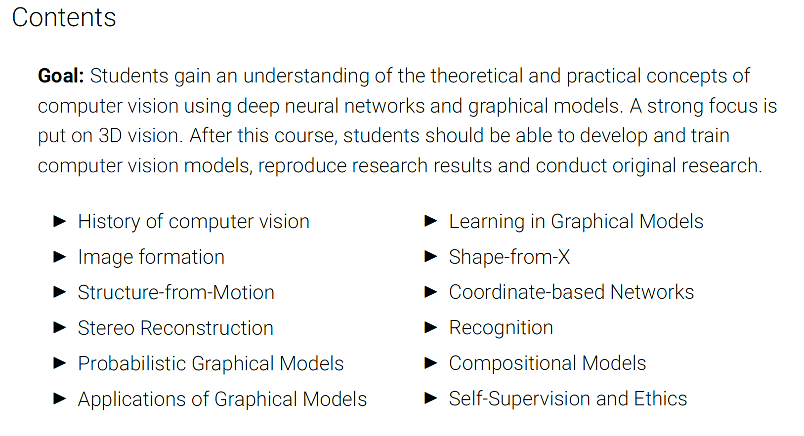
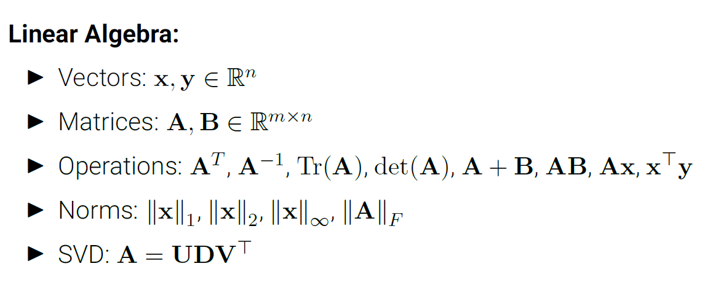
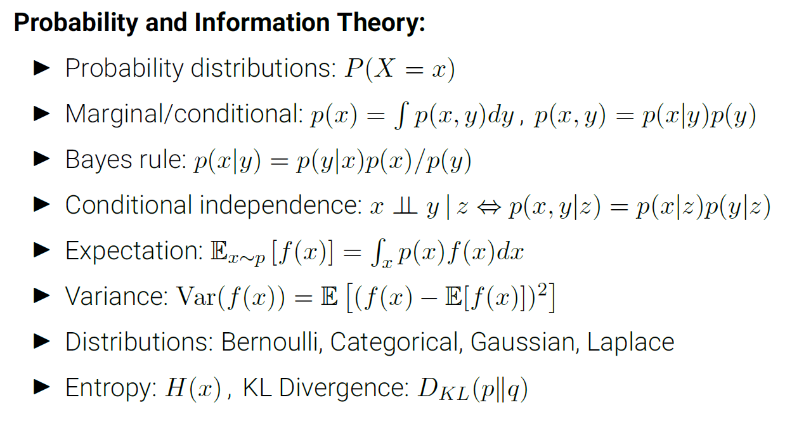
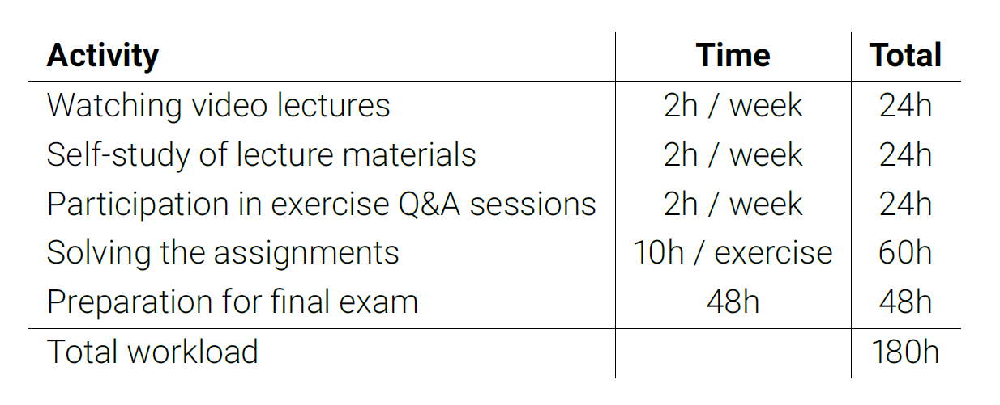

# Computer_Vision_notebook

It's a notebook of Computer Vision which is instructed by Prof. Dr.-Ing. Andreas Geiger in 2021.

Class link: [youtube](https://www.youtube.com/playlist?list=PL05umP7R6ij35L2MHGzis8AEHz7mg381_)

[Course Website](https://uni-tuebingen.de/fakultaeten/mathematisch-naturwissenschaftliche-fakultaet/fachbereiche/informatik/lehrstuehle/autonomous-vision/lectures/computer-vision/) with Slides, Lecture Notes, Problems and Solutions.

## L1 Introduction

### 1.1 Organization

#### Contents

#### Course Materials

##### Books

- Szeliski: Computer Vision: Algorithms and Applications
  - https://szeliski.org/Book/
- Hartley and Zisserman: Multiple View Geometry in Computer Vision
  - https://www.robots.ox.ac.uk/~vgg/hzbook/
- Nowozin and Lampert: Structured Learning and Prediction in Computer Vision
  - https://pub.ist.ac.at/~chl/papers/nowozin-fnt2011.pdf
- Goodfellow, Bengio, Courville: Deep Learning
  - http://www.deeplearningbook.org/
- Deisenroth, Faisal, Ong: Mathematics for Machine Learning
  - https://mml-book.github.io
- Petersen, Pedersen: The Matrix Cookbook
  - http://cs.toronto.edu/~bonner/courses/2018s/csc338/matrix_cookbook.pdf

##### Tutorials

- The Python Tutorial
  - https://docs.python.org/3/tutorial/
- NumPy Quickstart
  - https://numpy.org/devdocs/user/quickstart.html
- PyTorch Tutorial
  - https://pytorch.org/tutorials/
- Latex / Overleaf Tutorial
  - https://www.overleaf.com/learn

##### Frameworks / IDEs

- Visual Studio Code
  - https://code.visualstudio.com/
- Google Colab
  - https://colab.research.google.com

##### Courses

- Gkioulekas (CMU): Computer Vision
  - http://www.cs.cmu.edu/~16385/
- Owens (University of Michigan): Foundations of Computer Vision
  - https://web.eecs.umich.edu/~ahowens/eecs504/w20/
- Lazebnik (UIUC): Computer Vision
  - https://slazebni.cs.illinois.edu/spring19/
- Freeman and Isola (MIT): Advances in Computer Vision
  - http://6.869.csail.mit.edu/sp21/
- Seitz (University of Washington): Computer Vision
  - https://courses.cs.washington.edu/courses/cse576/20sp/
- Slide Decks covering Szeliski Book
  - http://szeliski.org/Book/

#### Prerequisites

##### Basic skills

- Basic math skills
  - Linear algebra, probability and information theory. If unsure, have a look at:
    - Goodfellow et al.: [Deep Learning (Book)](https://www.deeplearningbook.org/), Chapters 1-4
    - Luxburg: [Mathematics for Machine Learning (Lecture)](http://www.tml.cs.uni-tuebingen.de/teaching/2020_maths_for_ml/index.php)
    - Deisenroth et al.: [Mathematics for Machine Learning (Book)](https://mml-book.github.io/)
- Basic computer science skills
  - Variables, functions, loops, classes, algorithms
- Basic Python and PyTorch coding skills
  - https://docs.python.org/3/tutorial/
  - https://pytorch.org/tutorials/
- Experience with deep learning. If unsure, have a look at:
  - Geiger: [Deep Learning (Lecture)](https://uni-tuebingen.de/fakultaeten/mathematisch-naturwissenschaftliche-fakultaet/fachbereiche/informatik/lehrstuehle/autonomous-vision/lectures/deep-learning/)

##### Linear Algebra

- vector: $x,y \in \mathbb{R}^n$
- Matrices: $A,B \in \mathbb{R}^{m\times n}$
- Operations: $A^T, A^{-1}, Tr(A), det(A), A+B, AB, Ax, x^Ty$
- Norms: $\left \| x \right \|_1, \left \| x \right \| _2, \left \| x \right \| _\infty, \left \| A \right \| _F$
- SVD: $A = UDV^T$

##### Probability and Information Theory

- Probability distributions: $P(X=x)$
- Marginal / conditional: $p(x)=\int p(x,y)dy, p(x,y)=p(x|y)p(y)$
- Bayes rule: $p(x|y)=p(y|x)p(x)/p(y)$
- Conditional independence: $x\perp\!\!\!\perp y|z\Leftrightarrow r(x,y|z)=p(x|z)p(y|z)$
- Expectation: $\mathbb{E}_{x\sim p}[f(x)]=\int_x p(x)f(x)dx$
- Variance: $\mathrm{Var}(f(x))=\mathbb{E}[(f(x)-\mathbb{E}[f(x)])^2]$
- Distributions: Bernoulli, Categorical, Gaussian, Laplace
- Entropy: $H(x)$
- KL Divergence: $D_{KL}(p\parallel q)$

##### Deep Learning

- Machine learning basics, linear and logistic regression
- Computation graphs, backpropagation algorithm
- Activation and loss functions, initialization
- Regularization and optimization of deep neural networks
- Convolutional neural networks
- Recurrent neural networks
- Graph neural networks
- Autoencoders and generative adversarial networks

#### Time Management

### 1.2 Introduction

### 1.3 History of Computer Vision

## L2 Image Formation

### 2.1 Primitives and Transformations

### 2.2 Geometric Image Formation

### 2.3 Photometric Image Formation

### 2.4 Image Sensing Pipeline

## L3 Structure-from-Motion

### 3.1 Preliminaries

### 3.2 Two-frame Structure-from-Motion

### 3.3 Factorization

### 3.4 Bundle Adjustment

## L4 Stereo Reconstruction

### 4.1 Preliminaries

### 4.2 Block Matching

### 4.3 Siamese Networks

### 4.4 Spatial Regularization

### 4.5 End-to-End Learning

## L5 Probabilistic Graphical Models

### 5.1 Structured Prediction

### 5.2 Markov Random Fields

### 5.3 Factor Graphs

### 5.4 Belief Propagation

### 5.5 Examples

## L6 Applications of Graphical Models

### 6.1 Stereo Reconstruction

### 6.2 Multi-View Reconstruction

### 6.3 Optical Flow

## L7 Learning in Graphical Models

### 7.1 Conditional Random Fields

### 7.2 Parameter Estimation

### 7.3 Deep Structured Models

## L8 Shape-from-X

### 8.1 Shape-from-Shading

### 8.2 Photometric Stereo

### 8.3 Shape-from-X

### 8.4 Volumetric Fusion 

## L9 Coordinate-based Networks

### 9.1 Implicit Neural Representations

### 9.2 Differentiable Volumetric Rendering

### 9.3 Neural Radiance Fields

### 9.4 Generative Radiance Fields

## L10 Recognition

### 10.1 Image Classification

### 10.2 Semantic Segmentation

### 10.3 Object Detection and Segmentation

## L11 Self-Supervised Learning

### 11.1 Preliminaries

### 11.2 Task-specific Models

### 11.3 Pretext Tasks

### 11.4 Contrastive Learning

## L12 Diverse Topics in Computer Vision

### 12.1 Input Optimization

### 12.2 Compositional Models

### 12.3 Human Body Models

### 12.4 Deepfakes
